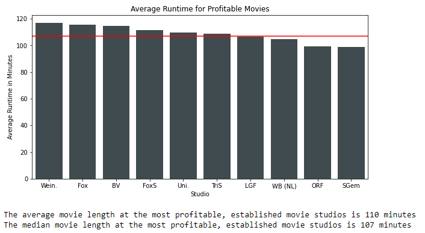
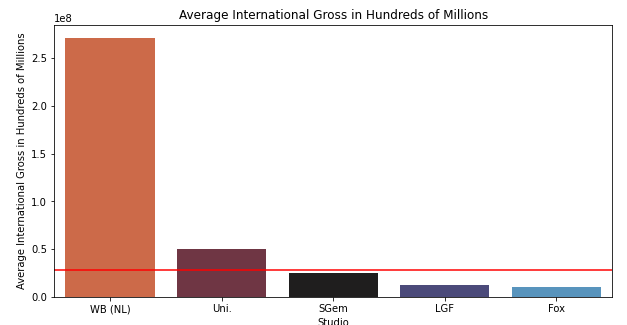

---
jupytext:
  text_representation:
    extension: .md
    format_name: myst
    format_version: 0.13
    jupytext_version: 1.14.4
kernelspec:
  display_name: Python (learn-env)
  language: python
  name: learn-env
---

<h1 style="font-weight: big">An Analysis on Profitable Movie Studios for Microsoft</h1>

+++

<figure>
    
</figure>

+++

<h1 style="font-weight: normal">Authors</h1>

+++

Ryan Moore, Gligor Vasilev, and Vinnie Amadio

+++

<h1 style="font-weight: normal">Overview</h1>

+++

The engagement team is tasked to advise Microsoft on how they can premier their first movie successfully and profitably. 

We investigated the profitable movies of the top ten profitable studios to see if there are trends and market opportunities that would be relevant to Microsoft as they produce their first original movie.

+++

<h1 style="font-weight: normal">Business Problem</h1>

+++

Microsoft is looking to break into the movie business, however they are unsure of the space. We are here to help visualize what movies have been profitable, which studios have released those, and what Microsoft can learn from these trends.

We first looked to see if there was any trends in average runtime that Microsoft should know about, analyzed any trends between budget spend amount and domestic and international returns, and then evaluated the movie landscape to see if there were any genres that were both underrepresented and historically very profitable.

+++

<h1 style="font-weight: normal">Data</h1>

+++

The dataset we are usin is derived from 'imdb.title.basics.csv' (IMDb), 'bom.movie_gross.csv' (Box Office Mojo), and 'tn.movie_budgets.csv' (The Numbers).

The data we will be working with will be exclusively from the top 10 proftable studios, and we will specifically be looking at production budget, domestic gross, foreign gross, worldwide gross, genre, and runtime

This dataset should give us a good idea of what profitable movie companies have been doing for to maintain their success.

+++

<h1 style="font-weight: normal">Results</h1>

+++

The engagement team concluded on four key recommendations for Microsoft to consider as they produce their first film:

- Keep Runtime Short:
    - Profitable studios keep their average movie runtime at 107 minutes
- Choose International
    - International box office increases exponentially as budget increases
- Scary-good Prospects
    - Horror, mystery, and thriller offerings are currently sparse and highly profitable
- Studio Partnership (Optional)
    - Partnering with Warner Brothers (New Line Cinema) would both maximize partner-studio knowledge of the genre and and maximize the global reach of the film.

+++

<h1 style="font-weight: normal">Keep Runtime Short:</h1>

+++

<figure>
    
</figure>

+++

The most profitable studios and their most profitable movies share a common runtime of about 107 minutes. It is in Microsoft's best interest to learn from these studios and produce a movie with this runtime.

+++

<h1 style="font-weight: normal">Choose International:</h1>

+++

<figure>
    
</figure>

+++

International returns appear to grow exponetially as the movie budget increases, so Microsoft should attempt to go for an international release if the movie budget exceeds 50m

+++

<h1 style="font-weight: normal">Scary-good Prospects:</h1>

+++

<figure>
    
</figure>

+++

<figure>
    
</figure>

+++

The horror, mystery, and thriller genres were determined to be both underrepresented and highly profitable in the output of the most profitable movie studios

+++

<h1 style="font-weight: normal">Studio Partnership:</h1>

+++

<figure>
    
</figure>

+++

If a movie studio partnership is persued, partnering with Warner Brothers would be the most appealing due to both their horror, mystery, and thriller expertiese and international reach

+++

<h1 style="font-weight: normal">Conclusions:</h1>

+++

The lessons learned from the most profitable studios are:
   - Runtime should stay at around 107 minutes
   - International box office returns increase exponetially as budget increases
   - Horror, Mystery, and Thriller genres are underrepresented but highly lucrative
   - If Microsoft were to persue a partnership in this field, they should partner with WB (NL) who have major horror blockbusters such as Annabelle and the IT series

+++

<h1 style="font-weight: normal">Repo Structure:</h1>

+++

This is the README.md. 

The 'Index.ipynb' contains the jupyter notebook that explains our information, processing, and further analysis

Our 'Slides.pdf' contains our google slides presentation that summarizes the findings. 

In 'Raw Data' you will be able to see the dataset we worked with

'Figures' contains the charts used in this README and 'Illustrations' contains the jpgs used throughout each of the notebooks
